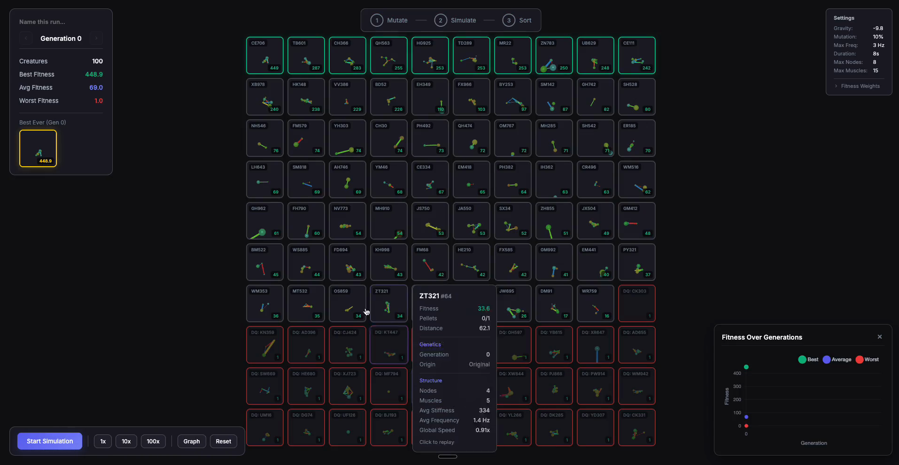

# Evolution Lab

A browser-based genetic algorithm simulator where soft-bodied creatures evolve to collect pellets. Watch populations of creatures develop movement strategies over generations through mutation, crossover, and natural selection.

[](https://github.com/SilenNaihin/genetic-algorithm/raw/main/assets/demo.mp4)

## Features

- **Soft-body Physics**: Creatures are made of nodes (spheres) connected by oscillating muscles (springs)
- **Pellet Collection**: Creatures are rewarded for collecting pellets that progressively spawn further away and higher up
- **Genetic Evolution**: Population evolves through selection, mutation, and crossover
- **Configurable Fitness Function**: Customize how creatures are evaluated
- **Generation History**: Auto-saves all runs to IndexedDB, navigate through past generations
- **Visual Replay**: Click any creature to watch its simulation replay

## Quick Start

```bash
npm install
npm run dev
```

Open `http://localhost:5173` in your browser.

## How It Works

### Simulation Cycle

1. **Mutate**: The bottom 50% of creatures are culled. Survivors reproduce with mutation to fill the population.
2. **Simulate**: Each creature runs in a physics simulation for the configured duration, attempting to collect pellets.
3. **Sort**: Creatures are ranked by fitness score.

### Creature Anatomy

- **Nodes**: Spheres with configurable size and friction
  - Cyan = low friction (slippery)
  - Orange = high friction (grippy)
- **Muscles**: Springs connecting nodes that oscillate at different frequencies
  - Blue = slow frequency (calm)
  - Red = fast frequency (energetic)
  - Thickness indicates stiffness

### Fitness Function

The fitness function determines how creatures are scored. Configure these weights in the main menu:

| Parameter | Description | Default |
|-----------|-------------|---------|
| **Pellet Weight** | Points per pellet collected | 100 |
| **Proximity Weight** | Bonus multiplier for being close to active pellet | 2.5 |
| **Proximity Distance** | Max distance for proximity bonus | 20 |
| **Movement Weight** | Points per unit of total path length | 1 |
| **Movement Cap** | Maximum movement bonus | 5 |
| **Distance Weight** | Points per unit of net displacement (start to end) | 0 |
| **Distance Cap** | Maximum distance bonus | 50 |
| **Base Fitness** | Starting fitness for all creatures | 10 |

**Formula:**
```
fitness = baseFitness
        + pelletsCollected * pelletWeight
        + max(0, proximityMaxDistance - distToPellet) * proximityWeight
        + min(totalPathLength * movementWeight, movementCap)
        + min(netDisplacement * distanceWeight, distanceCap)
```

**Tips:**
- Default settings prioritize pellet collection
- Increase `distanceWeight` to evolve creatures that travel far
- Increase `movementWeight` and `movementCap` to reward active movement
- Set `pelletWeight` to 0 and increase `distanceWeight` for distance-only evolution

### Simulation Parameters

| Parameter | Description | Default |
|-----------|-------------|---------|
| Gravity | Physics gravity (more negative = stronger) | -9.8 |
| Mutation Rate | Probability of gene mutation | 10% |
| Max Frequency | Maximum muscle oscillation frequency (Hz) | 3.0 |
| Sim Duration | Seconds per creature simulation | 8 |
| Max Nodes | Maximum nodes per creature | 8 |
| Max Muscles | Maximum muscles per creature | 15 |

### Persistence

- **Auto-save**: Every generation is automatically saved to IndexedDB
- **Load Runs**: Access previous runs from the main menu
- **Navigation**: Use arrows in the stats panel to browse generation history
- **Fitness Settings**: Saved to localStorage and persist across sessions

## Controls

### Main Menu
- Adjust simulation parameters with sliders
- Expand "Fitness Function Settings" to customize scoring
- Click "Start Evolution" to begin a new run
- Click "Load Run" to continue a previous run

### During Simulation
- **Next Step**: Advance to the next evolution step
- **1x/10x/100x**: Auto-run multiple generations
- **Graph**: Toggle fitness history graph
- **Reset**: Return to main menu
- Click any creature card to watch its replay

### Generation Navigation
- **< >**: Navigate through saved generations
- Click the generation number to jump to a specific generation
- Click the total to return to the current generation

## Project Structure

```
src/
├── __tests__/              # Test suite (Vitest)
│   ├── genetics.test.ts    # Selection, crossover, mutation, population tests
│   ├── genome.test.ts      # Genome generation tests
│   ├── math.test.ts        # Math utility tests
│   ├── simulation.test.ts  # BatchSimulator tests
│   └── storage.test.ts     # IndexedDB storage tests
├── core/                   # Domain models
│   ├── Creature.ts         # Creature entity (genome + physics + rendering)
│   ├── Genome.ts           # Genome generation utilities
│   └── Pellet.ts           # Pellet entity for collection
├── genetics/               # Evolutionary algorithm
│   ├── Crossover.ts        # Genetic crossover operators
│   ├── Mutation.ts         # Mutation operators
│   ├── Population.ts       # Population management
│   └── Selection.ts        # Selection operators
├── physics/                # Physics engine
│   ├── BodyFactory.ts      # Creates physics bodies for creatures
│   └── PhysicsWorld.ts     # Cannon.js world wrapper
├── rendering/              # 3D visualization
│   ├── CreatureRenderer.ts # Three.js mesh creation for creatures
│   └── SceneManager.ts     # Three.js scene setup
├── simulation/             # Simulation engine
│   └── BatchSimulator.ts   # Headless creature simulation
├── storage/                # Persistence
│   └── RunStorage.ts       # IndexedDB storage for runs/generations
├── types/                  # TypeScript interfaces
│   ├── genome.ts           # Genome type definitions
│   ├── index.ts            # Re-exports
│   └── simulation.ts       # Simulation config types
├── ui/                     # UI components
│   └── GraphPanel.ts       # Fitness history graph
├── utils/                  # Shared utilities
│   ├── id.ts               # ID generation
│   └── math.ts             # Math utilities (distance, lerp, clamp)
└── main.ts                 # Application entry point
```

## Technologies

- **TypeScript** - Type-safe development
- **Three.js** - 3D rendering
- **Cannon-ES** - Physics simulation
- **Vite** - Build tool
- **IndexedDB** - Persistent storage

## License

MIT
